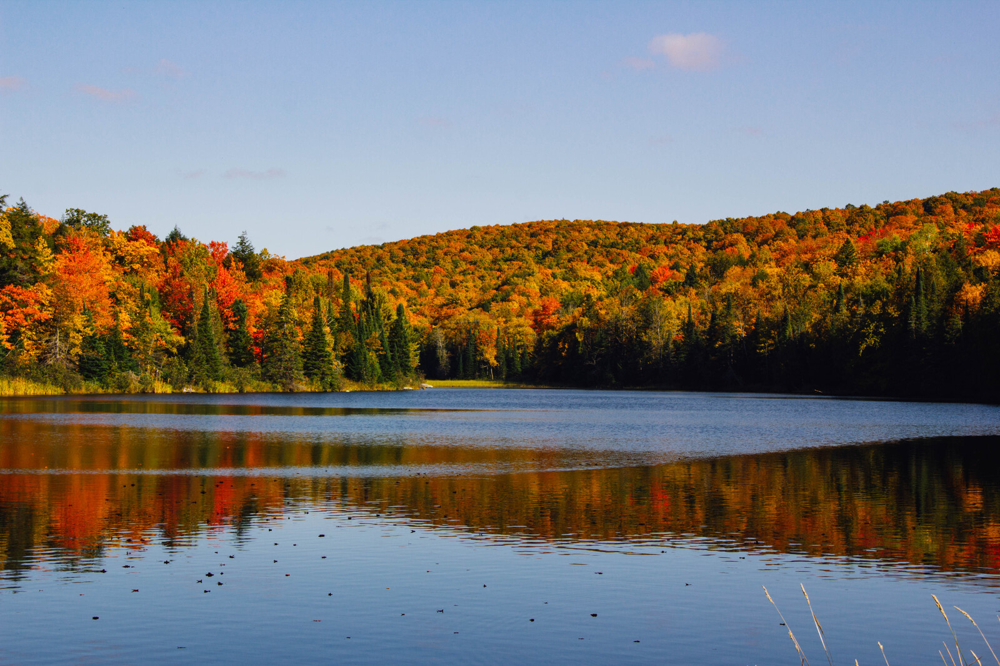
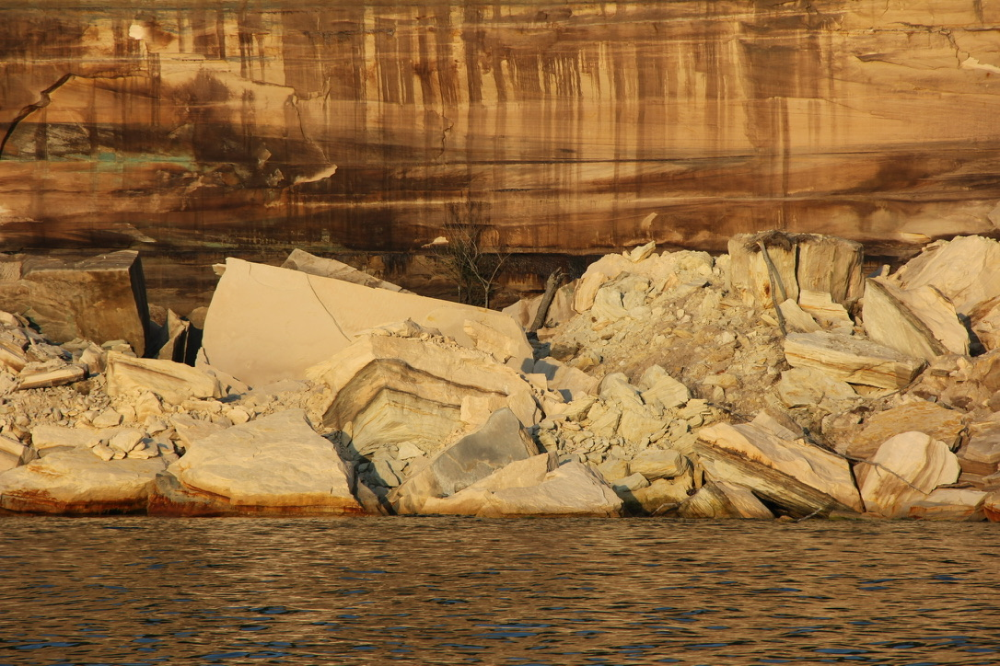
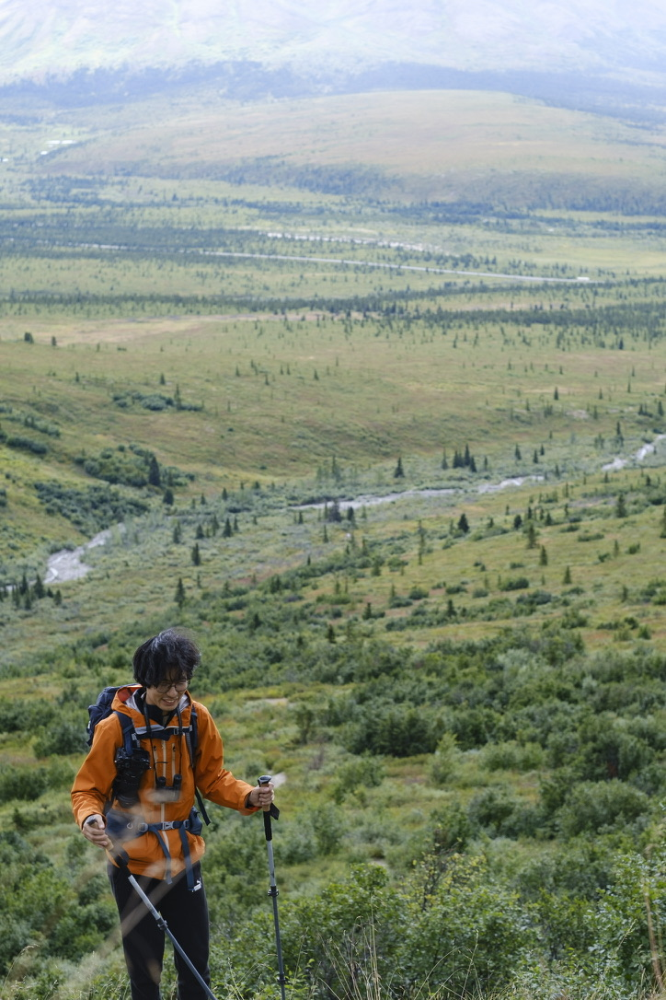
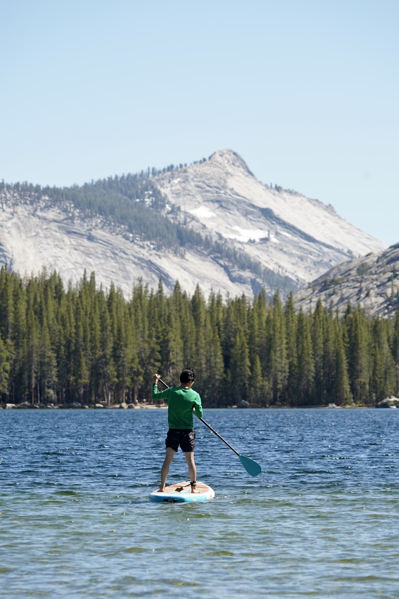
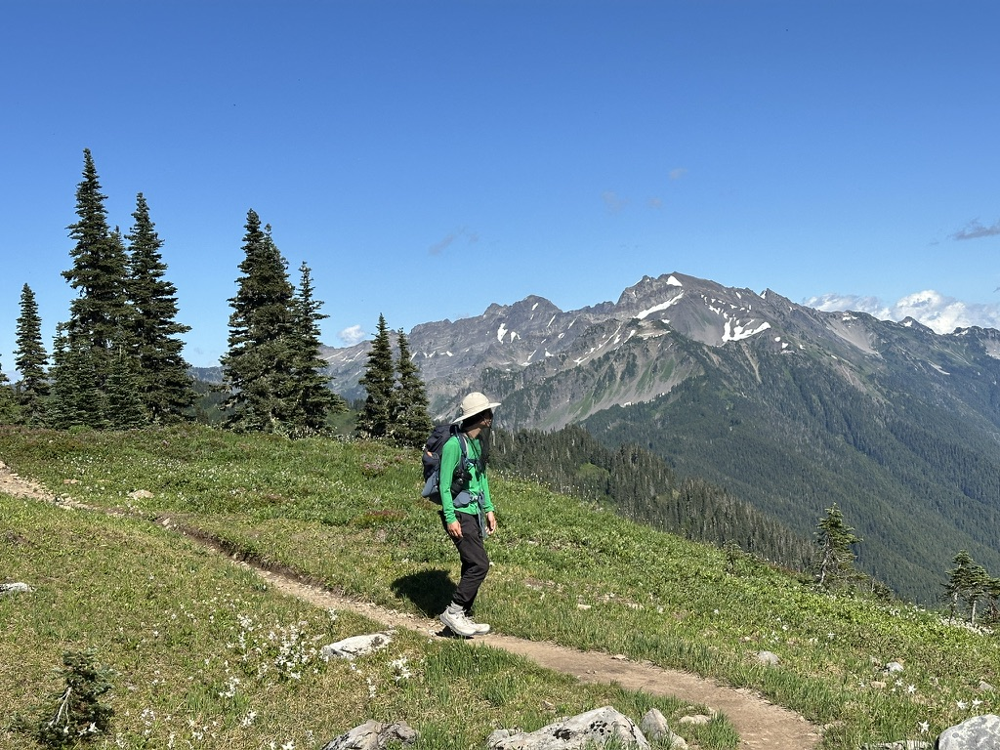
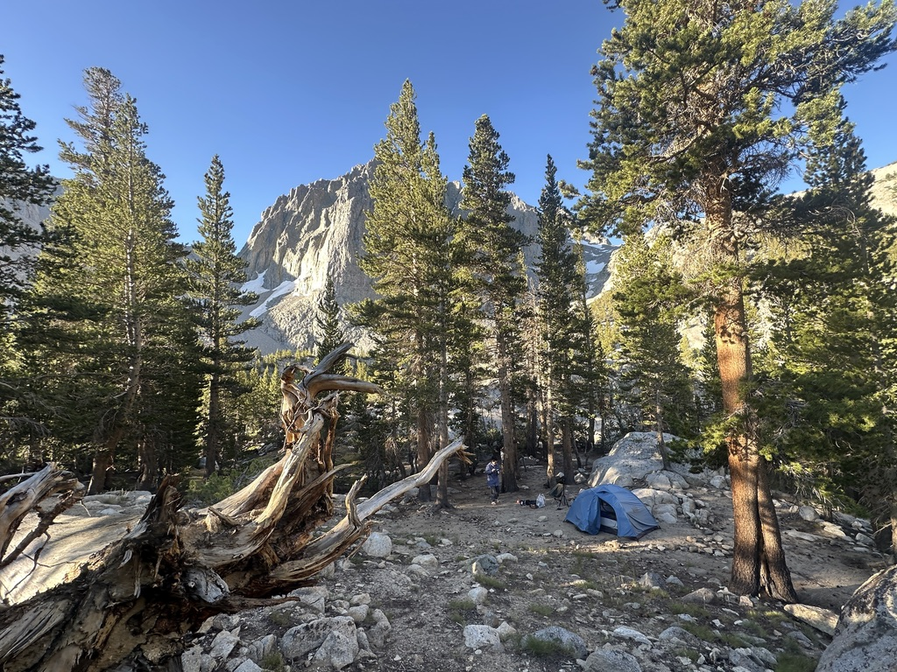
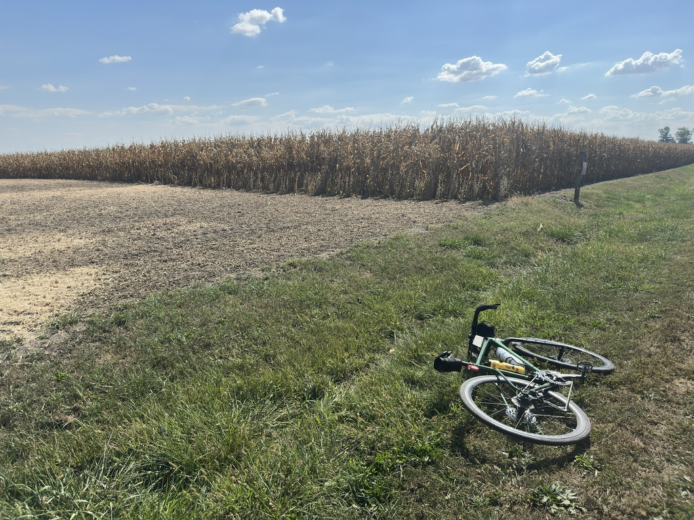
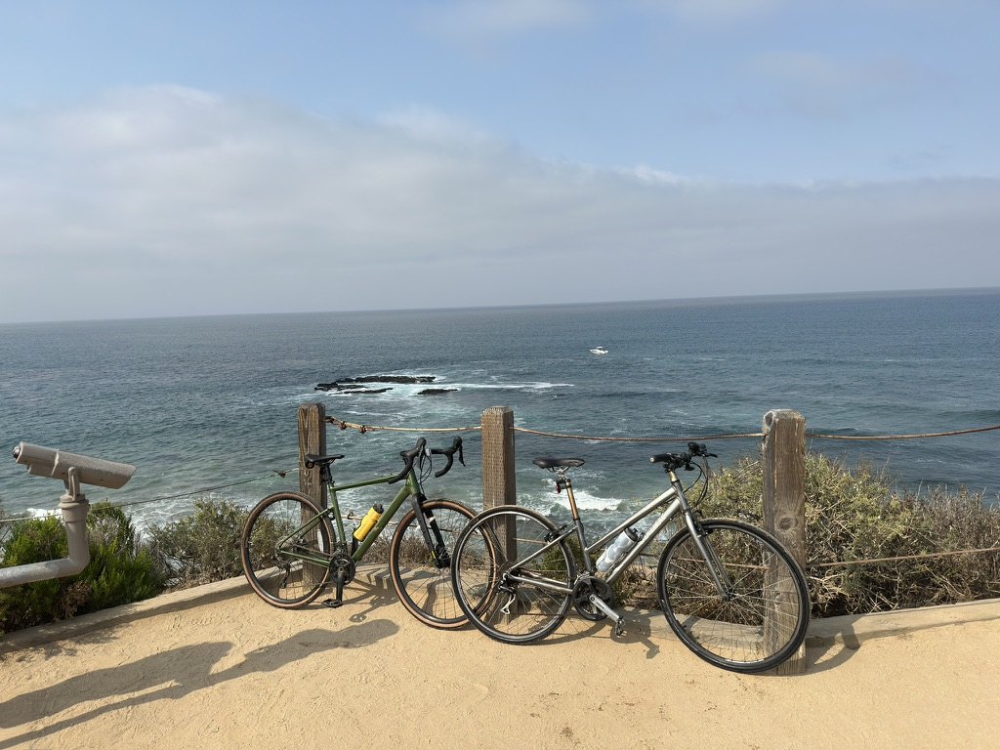



{% include pic-gallery-vert.html
  gallery_name="fun-pics"
  img1_src="../../assets/images/fun-pics/denali.jpeg"
  img1_alt="Denali NP"
  img1_caption="Savage Aipine Trail, Denali National Park"
  img2_src="../../assets/images/fun-pics/tenayalake.jpeg"
  img2_alt="Yosemite"
  img2_caption="Tenaya Lake, Yosemite National Park"
  img3_src="../../assets/images/fun-pics/paradiserainier.jpeg"
  img3_alt="Skyline"
  img3_caption="Skyline Trail, Mount Rainier National Park"
  img4_src="../../assets/images/fun-pics/jmwinyo.jpg"
  img4_alt="JM"
  img4_caption="John Muir Wilderness, Inyo National Forest"
  
%}





<!-- |||
|:--:| |:--:| 
|*Upper Pennisula of Michigan, US 41 between Marquette and L'Anse*|*Pictured Rocks National Lakeshore*|
{: style="width:100%; table-layout: fixed;" }

|||
|:--:| |:--:| 
|*Savage Aipine Trail at Denali National Park*|*Tenaya Lake at Yosemite National Park*|
{: style="width:100%; table-layout: fixed;" }

|||
|:--:| |:--:| 
|*High Divide Trail at Olympic National Park*|*Big Pine Lakes*|
{: style="width:100%; table-layout: fixed;" }

|||
|:--:| |:--:| 
|*Cycling in C-U*|*Crystal Cove State Park, California*|
{: style="width:100%; table-layout: fixed;" } -->

